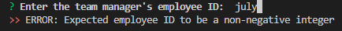

<base target="_blank">

# Team Profile Generator

<a href="#description">Description</a> •
<a href="#key-features">Key Features</a> •
<a href="#installation">Installation</a> •
<a href="#usage">Usage</a> •
<a href="#tests">Tests</a> •
<a href="#technologies-used">Technologies Used</a> •
<a href="#concepts-demonstrated">Concepts Demonstrated</a> •
<a href="#author">Author</a>

-------------------------------------------------------

[Video Demo on YouTube](#TODO)

-------------------------------------------------------

## Description

<a href="#add-a-team-manager">Add a Team Manager</a> •
<a href="#add-an-engineer">Add an Engineer</a> •
<a href="#add-an-intern">Add an Intern</a> •
<a href="#finish-building-my-team">Finish Building my Team</a>

### Add a Team Manager

When you start the program, you will prompted for information about the team manager:                             
                        

NOTE: If at any time you enter invalid information for an employee:                    
              

An error is displayed:                                
                     

And you are prompted for the same information:                 
                          

When you successfully enter information for the team manager, you have the option to add another team member:                        
                     

### Add an Engineer

If you select add "Add an Engineer", you will be prompted to enter information about the engineer:                 
                                        

And then you're prompted to add another team member:               
                        

### Add an Intern

If you select add "Add an Intern", you will be prompted to enter information about the intern:                 
             

And then you're prompted to add another team member:               
                        

### Finish Building My Team

If you select "Finish building my team", the program will end and a website is generated representing the team profile of the team that you entered.          
NOTE: No matter the order that you add engineers and interns, the team profile will always show the manager first, then the engineers, and finally the interns, because who cares about interns? They're just going to accept the first paid position they're offered anyways.                   

The following shows the website generated for the above examples, plus an engineer named Alex, an engineer named Grace, and an intern named John:          

Desktop Demo:                          
           

Mobile Demo:                                  
                         

## Key Features

- Generate a team profile easily.
- The team portfolio web site is media-responsive: it looks good at any resolution!

## Installation

- Clone this repository down to your hard drive.
- Make sure [node.js](https://nodejs.org/en/) and the npm package manager are both installed.
- Navigate to the directory that you cloned the repo down to in a terminal window and type `npm install` to install all dependencies.

## Usage

- Navigate using a command line interface to the directory the repo was cloned into in the installation step.
- Type `node index.js` in the command line.
- Answer the prompts.

## Tests

## Technologies Used

- [Inquirer Package](https://www.npmjs.com/package/inquirer)
- [Jest Test Package](https://jestjs.io/)
- [node.js](https://nodejs.org/en/)
- [Bootstrap v5.2.2](https://getbootstrap.com/)
- [FontAwesome v6 Icons](https://fontawesome.com/)
- [JavaScript](https://www.javascript.com/)

## Concepts Demonstrated

- Test-Driven Design.
- Object-Oriented programming, including polymorphism.
- The use of node.js
- Installing and using node.js packages using npm.
- Mobile-Responsive design.
- Writing to a file using JavaScript.
- General JavaScript and programming knowledge.   

## Author

Adam Ferro
- [Github](https://github.com/GeminiAd)
- [Linked-In](https://www.linkedin.com/in/adam-ferro)